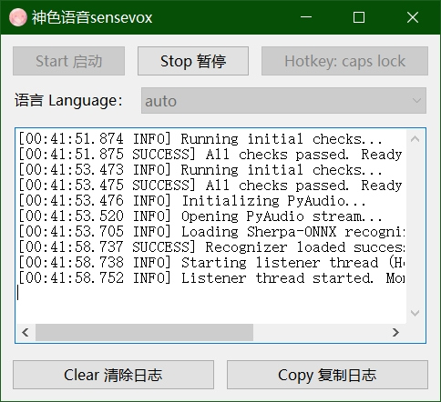
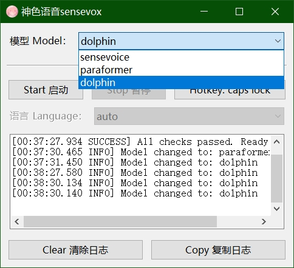

先用`qwen-3-235b-a22b-instruct-2507`写wxpython界面，
然后让`gemini2.5pro`把flet的功能照搬过来。

优点是简洁点、流畅点、打包快得多、体积内存占用小点、也不会有flet首次启动要向回环地址联网的问题、wxpython代码比flet少了200多行、对ai来说wxpython的知识比flet的多，面向ai友好。

缺点是载入模型的5秒会卡主界面，不过不影响后续使用，懒得改。

未来打算直接在单程序里加入sherpa-onnx的其他模型的选择配置，不只是sensevoice。

日志里的识别耗时应该是有问题的，之前flet也有这个问题，实际要快得多，应该都是0.1秒上下，不应该0.2、0.3，不知道AI是怎么写的，改不了就这样吧。

打包先安装依赖 `pip install numpy pyaudio keyboard sherpa-onnx wxPython`

然后 `pyinstaller --windowed --name=sensevox_wx sensevox_wx.py`

